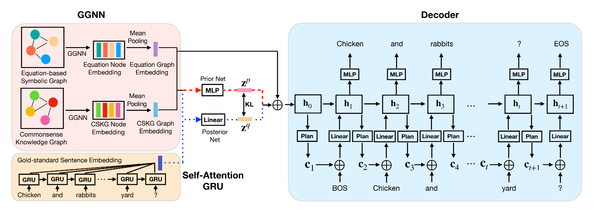
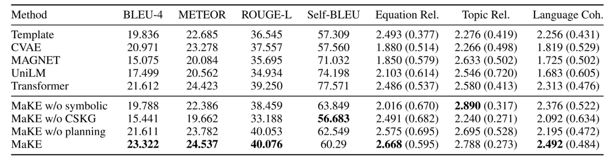

# MaKE

This repository is the implementation of  Mathematical Word Problem Generation from Commonsense Knowledge
Graph and Equations

 

### Dependencies
Python 3.6 
[Pytorch](https://pytorch.org) >= 1.4.0

 

### Results

 

### License
TAL License
